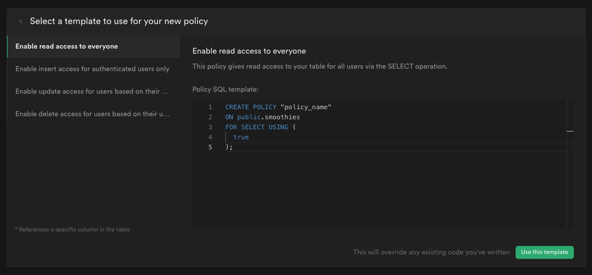
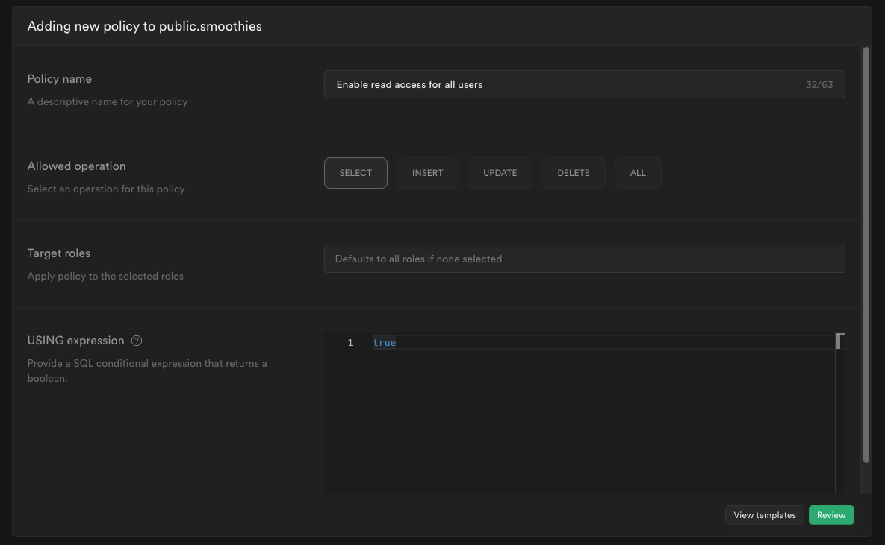

# Supabase Crash Course

Tutorial: [Supabase Crash Course](https://www.youtube.com/playlist?list=PL4cUxeGkcC9hUb6sHthUEwG7r9VDPBMKO) by The Net Ninja
Code: [Github repository](https://github.com/iamshaunjp/Supabase-Tutorial-for-Beginners/tree/starter-project/src)

Contents:
- [Supabase Crash Course](#supabase-crash-course)
  - [01. Creating a project](#01-creating-a-project)
  - [02. Database - Fetching data](#02-database---fetching-data)
  - [03. Adding New Records](#03-adding-new-records)
  - [04. Fetching and Updating Single Records](#04-fetching-and-updating-single-records)
  - [05. Deleting Records](#05-deleting-records)
  - [06. Updating local state](#06-updating-local-state)
  - [07. Ordering data](#07-ordering-data)
  - [08. RLS & Policies](#08-rls--policies)
  - [Notes about client side ergonomics (supabase-js)](#notes-about-client-side-ergonomics-supabase-js)
    - [DELETE](#delete)
    - [UPDATE](#update)
    - [CREATE](#create)
    - [Other approaches](#other-approaches)

## 01. Creating a project

Go to Subabase and create an account. Create a project with an appropriate password.


Copy the public anon API key and project URL.


Store these in a `.env` file. e.g.
```env
REACT_APP_SUPABASE_URL=ABC.com
REACT_APP_ANON_KEY=abc.123.xyz
```

Install Supabase library:
```bash
npm install @supabase/supabase-js
```

Under the API tab, there will instuctions/documentation on how to connect and do things.

Initialse a Supabase client in a module `src/config/supabaseClient.js`:
```js
import { createClient } from "@supabase/supabase-js";

const supabaseUrl = "https://huwcariuwoamctredfhk.supabase.co";
const supabaseKey = process.env.REACT_APP_SUPABASE_KEY;
const supabase = createClient(supabaseUrl, supabaseKey);

export default supabase;
```

## 02. Database - Fetching data

Let's create a new table: `smoothies`


Let's create a new row.


Now lets fetch data using the Supabase JS client:
```js
import { useEffect, useState } from "react";
import supabase from "../config/supabaseClient";
import SmoothieCard from "../components/SmoothieCard";

const Home = () => {
    const [fetchError, setFetchError] = useState(null);
    const [smoothies, setSmoothies] = useState(null);

    useEffect(() => {
        const fetchSmoothies = async () => {
        const { data, error } = await supabase.from("smoothies").select();
        if (error) {
            setFetchError("Could not fetch the smoothies...");
            setSmoothies(null);
            console.log(error);
        }
        if (data) {
            setSmoothies(data);
            setFetchError(null);
        }
        };
        fetchSmoothies();
    }, []);
    // ...
    <div className="smoothie-grid">
        {smoothies.map((smoothie) => (
            <SmoothieCard key={smoothie.id} smoothie={smoothie} />
        ))}
    </div>
    // ...
}
```

## 03. Adding New Records

We will create the `Create.js` page containing a form to create a smoothie recipe.

Data can be added to the database using:
```js
const { data, error } = await supabase
    .from("smoothies")
    .insert([{ title, method, rating }]);
```

## 04. Fetching and Updating Single Records

We want the user to view single smoothie with the `/<smoothie-id>` path.
This page will enable the user to update the existing smoothie.

Fetch data:
```js
const { data, error } = await supabase
    .from("smoothies")
    .select()
    .eq("id", id)
    .single();
```

Update data:
```js
const { data, error } = await supabase
    .from("smoothies")
    .update({ title, method, rating })
    .eq("id", id);
```

Note that when you do create or updates, in supabase-js v2,
you need to include the select clause to return the data.

## 05. Deleting Records

```js
const { data, error } = await supabase
    .from("smoothies")
    .delete()
    .eq("id", smoothie.id);
```

## 06. Updating local state

When we delete a record, the UI does not update. We need it to update.

We will use a function passed in as a prop into the child component.
```js
// Home.js
const handleDelete = (id) => {
    setSmoothies((prevSmoothies) => {
        return prevSmoothies.filter((sm) => sm.id !== id);
    });
};
// ...
<SmoothieCard
    // ...
    onDelete={handleDelete}
/>

// SmoothieCard.js
onDelete(smoothie.id);
```

It is probably more convenient to use subscriptions.

## 07. Ordering data

Add ordering by using `order`
```js
const [orderBy, setOrderBy] = useState("created_at");
// ...
const { data, error } = await supabase
    .from("smoothies")
    .select()
    .order(orderBy, { ascending: false });
```

## 08. RLS & Policies

Turn on Row Level Security (RLS) in your table in the Supabase dashboard.

Navigate to the Athentication tab.
Go to Policies.

You can see the table that you have activated RLS for.

Now:
* The returned list of smoothies is an empty array because we were not granted access to any of the records.
* The create new smoothie page form does not work and throws `{ code: "42501", details: null, hint: null, message: "new row violates row-level security policy for table \"smoothies\"" }`
* etc...

We can create a policy to allow users to view the list of smoothies.
Select a template to get started with.



Then you can set the allowed operation, user roles (authenticated/anon/supabase_functions_admin/etc), and SQL expression.



We will enable access to all things for all users.

Note:
* `USING` - determines which rows are visible. silently suppresses rows, meaning that no error is thrown when doing a select query. also invalidates other query types because the user cannot see the record
* `CHECK` - used checks if an insert or update is valid and throws an error otherwise


## Notes about client side ergonomics (supabase-js)

### DELETE

DELETE with no USING expression allowing delete. Throws an empty error object:
```json
[]
```

And if we add `.single()`. Throws error object:
```json
{
  "code": "PGRST116",
  "details": "Results contain 0 rows, application/vnd.pgrst.object+json requires 1 row",
  "hint": null,
  "message": "JSON object requested, multiple (or no) rows returned"
}
```

DELETE does not utilise CHECK. (idk, why that makes sense)

It is true that we might want to silently supress a DELETE query for rows a user cannot view.

But what about DELETE on rows that a user can view? Cannot throw an error for this.

It is annoying that we cannot recieve an error on the client.

### UPDATE

UPDATE with no USING expression allowing delete. Does not throw any error. Returns data object:
```json
[]
```

And if we add `.single()`. Throws error object:
```json
{
  "code": "PGRST116",
  "details": "Results contain 0 rows, application/vnd.pgrst.object+json requires 1 row",
  "hint": null,
  "message": "JSON object requested, multiple (or no) rows returned"
}
```

UPDATE with no CHECK expression throws an error:
```json
{
  "code": "42501",
  "details": null,
  "hint": null,
  "message": "new row violates row-level security policy for table \"smoothies\""
}
```

It is a little bit weird that it throws an RLS error when you are trying to update
rows that you cannot view.

But I guess that makes sense if the CHECK expression becomes valid
on different rows.

### CREATE

CREATE with no CHECK expression throws an error as expected:
```json
{
  "code": "42501",
  "details": null,
  "hint": null,
  "message": "new row violates row-level security policy for table \"smoothies\""
}
```

### Other approaches

At first, it feels like it would be nice to have an interface that more closely resembles
Firebase or NoSQL as an alternative option.

But it would actually wind up looking reletively similar and not really provide much benefit... I don't think.

e.g.
```js
const { data: list, error } = supabase.from("smoothies").eq("type", "2")
const { data: record, error } = supabase.from("smoothies").doc("asdasd").get()
const { data: subscription, error } = supabase.from("smoothies").doc("asdasd").subscribe()
```

TODO: check if subsciptions are compatible with svelte auto-subscriptions.
```js
supabase.from("smoothies").on("*", callback).subscribe(callback)

const smoothies = supabase.from("smoothies").on("*")
{$smoothies}
```

* The `.on()` method returns an object containing a subscribe method. Looks good.
* The `subscribe()` method accepts some sort of callback. Looks good (assuming it triggers based on the subscription).
* The `subscribe()` method returns an object containing an unsubscribe method. Looks good (after testing, it looks like Svelte supports both an unsubscribe method and object containing an unsubscribe method!).

Nope it does NOT WORK.

Need to call `.subscribe()` method to activate the subscription and `$foo` on `foo.on('o')` returns
a string "SUBSCRIBED".

Need to wrap the subscribe call with another function.
