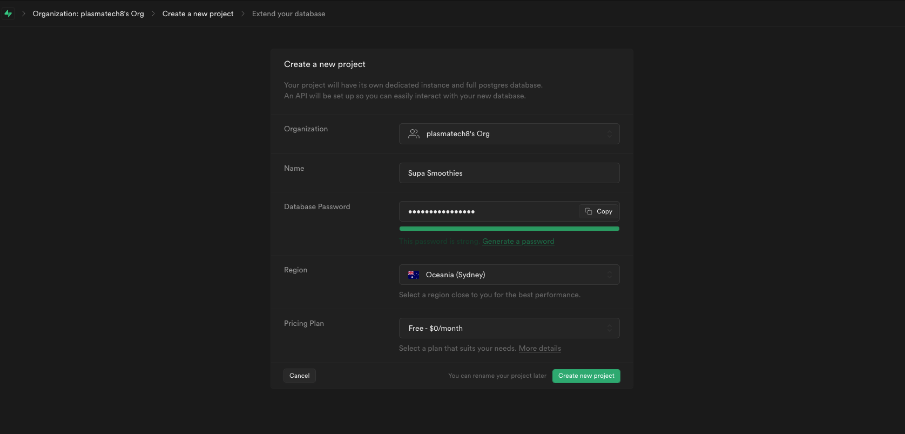
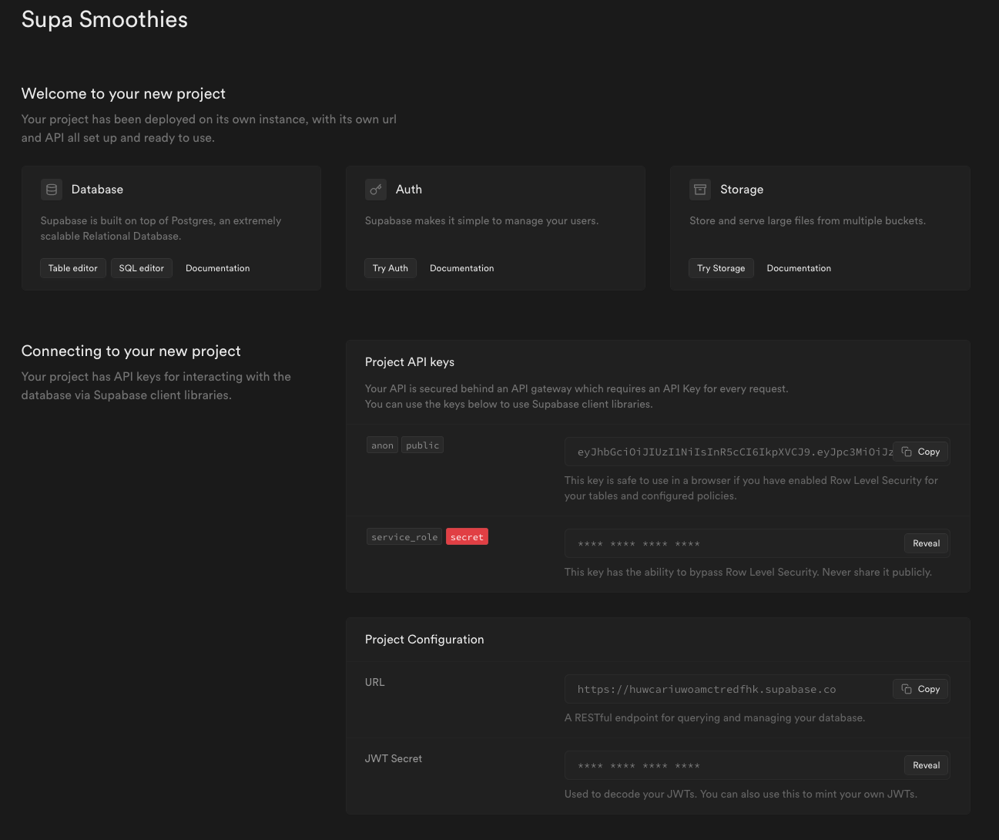
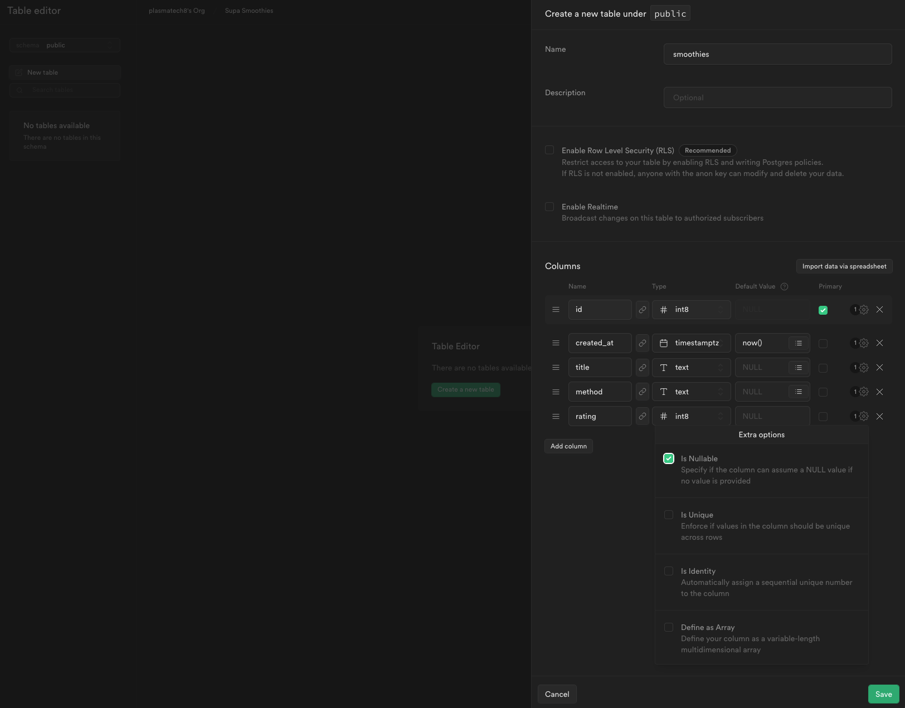
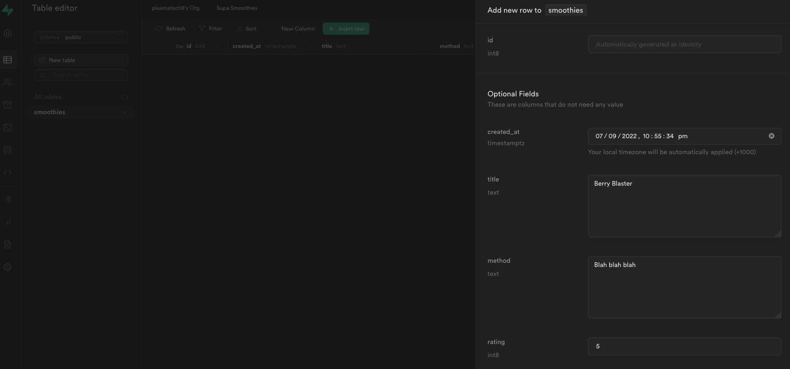

# Supabase Crash Course

Tutorial: [Supabase Crash Course](https://www.youtube.com/playlist?list=PL4cUxeGkcC9hUb6sHthUEwG7r9VDPBMKO) by The Net Ninja
Code: [Github repository](https://github.com/iamshaunjp/Supabase-Tutorial-for-Beginners/tree/starter-project/src)

Contents:
- [Supabase Crash Course](#supabase-crash-course)
  - [01. Creating a project](#01-creating-a-project)
  - [02. Database - Fetching data](#02-database---fetching-data)
  - [03. Adding New Records](#03-adding-new-records)

## 01. Creating a project

Go to Subabase and create an account. Create a project with an appropriate password.



Copy the public anon API key and project URL.



Store these in a `.env` file. e.g.
```env
REACT_APP_SUPABASE_URL=ABC.com
REACT_APP_ANON_KEY=abc.123.xyz
```

Install Supabase library:
```bash
npm install @supabase/supabase-js
```

Under the API tab, there will instuctions/documentation on how to connect and do things.

Initialse a Supabase client in a module `src/config/supabaseClient.js`:
```js
import { createClient } from "@supabase/supabase-js";

const supabaseUrl = "https://huwcariuwoamctredfhk.supabase.co";
const supabaseKey = process.env.REACT_APP_SUPABASE_KEY;
const supabase = createClient(supabaseUrl, supabaseKey);

export default supabase;
```

## 02. Database - Fetching data

Let's create a new table: `smoothies`



Let's create a new row.



Now lets fetch data using the Supabase JS client:
```js
import { useEffect, useState } from "react";
import supabase from "../config/supabaseClient";
import SmoothieCard from "../components/SmoothieCard";

const Home = () => {
    const [fetchError, setFetchError] = useState(null);
    const [smoothies, setSmoothies] = useState(null);

    useEffect(() => {
        const fetchSmoothies = async () => {
        const { data, error } = await supabase.from("smoothies").select();
        if (error) {
            setFetchError("Could not fetch the smoothies...");
            setSmoothies(null);
            console.log(error);
        }
        if (data) {
            setSmoothies(data);
            setFetchError(null);
        }
        };
        fetchSmoothies();
    }, []);
    // ...
    <div className="smoothie-grid">
        {smoothies.map((smoothie) => (
            <SmoothieCard key={smoothie.id} smoothie={smoothie} />
        ))}
    </div>
    // ...
}
```

## 03. Adding New Records

We will create the `Create.js` page containing a form to create a smoothie recipe.

Data can be added to the database using:
```js
const { data, error } = await supabase
    .from("smoothies")
    .insert([{ title, method, rating }]);
```