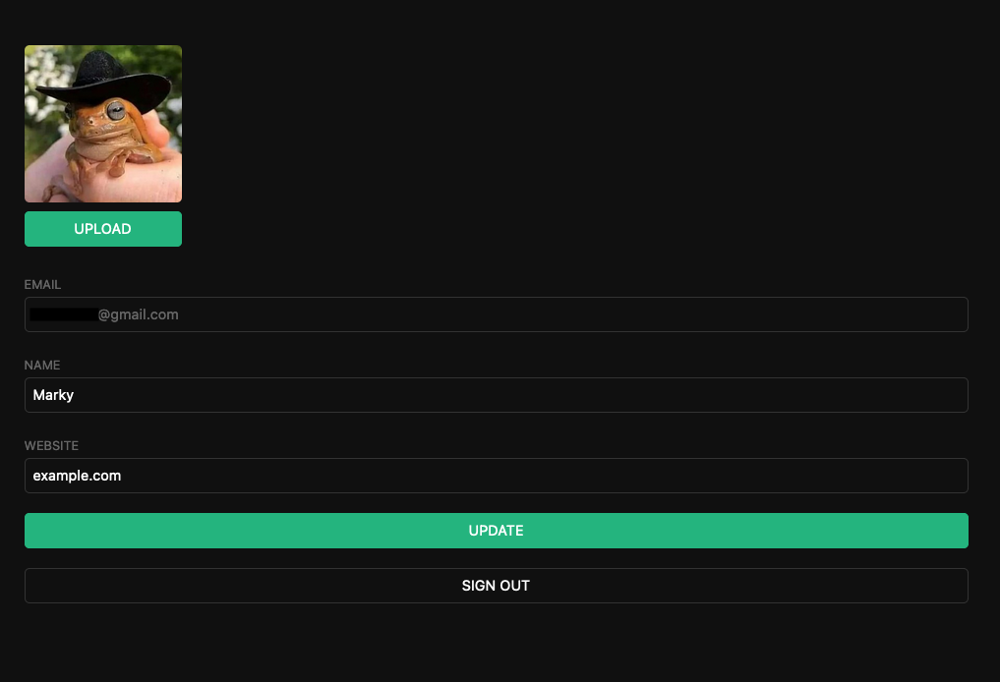

# Supabase Quickstart - SvelteKit - Todo App

Following: https://supabase.com/docs/guides/with-sveltekit




It instructs us to use app.supabase.com, but we should be able to develop locally as well
if we do `supabase db remote commit`. We also need to setup the `config.toml` with the
settings manually.

> question: are all features supported?
> * Edge functions only supports a single function
> * Is federated auth supported? Magic link auth?
> * Storage?
> It would be better if there was no difference between dev/prod servers

- [Supabase Quickstart - SvelteKit - Todo App](#supabase-quickstart---sveltekit---todo-app)
  - [01. Project Set-Up](#01-project-set-up)
  - [02. Building the App](#02-building-the-app)
  - [03. Bonus: Profile photos](#03-bonus-profile-photos)
  - [04. Further Updates](#04-further-updates)

## 01. Project Set-Up

Go to [app.supabase.com](https://app.supabase.com) and create a new project.

Go into SQL Editor and run the `User Management Starter`

```sql
-- Create a table for Public Profiles
create table profiles (
  id uuid references auth.users not null,
  updated_at timestamp with time zone,
  username text unique,
  avatar_url text,
  website text,

  primary key (id),
  unique(username),
  constraint username_length check (char_length(username) >= 3)
);

alter table profiles
  enable row level security;

create policy "Public profiles are viewable by everyone." on profiles
  for select using (true);

create policy "Users can insert their own profile." on profiles
  for insert with check (auth.uid() = id);

create policy "Users can update own profile." on profiles
  for update using (auth.uid() = id);

-- Set up Realtime!
begin;
  drop publication if exists supabase_realtime;
  create publication supabase_realtime;
commit;
alter publication supabase_realtime
  add table profiles;

-- Set up Storage!
insert into storage.buckets (id, name)
  values ('avatars', 'avatars');

create policy "Avatar images are publicly accessible." on storage.objects
  for select using (bucket_id = 'avatars');

create policy "Anyone can upload an avatar." on storage.objects
  for insert with check (bucket_id = 'avatars');

create policy "Anyone can update an avatar." on storage.objects
  for update with check (bucket_id = 'avatars');
```

Get API keys `URL` and `anon` key from the API page.

## 02. Building the App

Initialise a SvelteKit skeleton app.

```bash
npm init svelte@next supabase-sveltekit
cd supabase-sveltekit
npm install
npm install @supabase/supabase-js
```

Create a `.env` file.

```env
VITE_SUPABASE_URL="YOUR_SUPABASE_URL"
VITE_SUPABASE_ANON_KEY="YOUR_SUPABASE_KEY"
```

Create a Supabase client object under `lib/supabaseClient.ts`

```ts
import { createClient } from '@supabase/supabase-js'

const supabaseUrl = import.meta.env.VITE_SUPABASE_URL
const supabaseAnonKey = import.meta.env.VITE_SUPABASE_ANON_KEY

export const supabase = createClient(supabaseUrl, supabaseAnonKey)
```

Import the `src/lib/global.css` file.

Create a Login Component. (I edited the code slightly to make it more compact)

```svelte
<script>
  import { supabase } from '$lib/supabaseClient'

  let loading = false
  let email

  const handleLogin = async () => {
    loading = true;
    const { error } = await supabase.auth.signIn({ email });
    if (error) {
        alert(error.message);
    } else {
        alert('Check your email for the login link!');
    }
    loading = false;
  }
</script>

<form class="row flex-center flex" on:submit|preventDefault="{handleLogin}">
  <div class="col-6 form-widget">
    <h1 class="header">Supabase + Svelte</h1>
    <p class="description">Sign in via magic link with your email below</p>
    <div>
      <input
        class="inputField"
        type="email"
        placeholder="Your email"
        bind:value="{email}"
      />
    </div>
    <div>
      <input type="submit" class='button block' value={loading ? "Loading" :
      "Send magic link"} disabled={loading} />
    </div>
  </div>
</form>
```

User store under `lib/sessionStore.ts`. (NOTE I might update the code later to the way that I like it)

```ts
import type { User } from '@supabase/supabase-js';
import { writable } from 'svelte/store';

export const user = writable<User | null>();
```

Create account page under `lib/profile.svelte`. (made some edits)

```svelte
<script lang="ts">
  import { supabase } from '$lib/supabaseClient'
  import { user } from '$lib/sessionStore'

  let loading = true;
  let username: string;
  let website: string;
  let avatar_url: string;

  function getProfile(node: Node) {
    loading = true;
    const user = supabase.auth.user();

    supabase
      .from("profiles")
      .select(`username, website, avatar_url`)
      .eq("id", user?.id)
      .single()
      .then(({ data, error }) => {
        if (error) {
          alert(error.message);
        } else {
          username = data.username;
          website = data.website;
          avatar_url = data.avatar_url;
        }
        loading = false;
      });
  }

  async function updateProfile() {
    try {
      loading = true
      const user = supabase.auth.user()
      if (!user) throw Error("No user signed in.");
      const updates = {
        id: user.id,
        username,
        website,
        avatar_url,
        updated_at: new Date(),
      }
      let { error } = await supabase.from('profiles').upsert(updates, {
        returning: 'minimal', // Don't return the value after inserting
      })
      if (error) throw error;
    } catch(error: any) {
      alert(error.message)
    }
    loading = false;
  }

  async function signOut() {
    try {
      loading = true
      let { error } = await supabase.auth.signOut()
      if (error) throw error
    } catch (error: any) {
      alert(error.message)
    } finally {
      loading = false
    }

  }
</script>

<form
  use:getProfile
  class="form-widget"
  on:submit|preventDefault="{updateProfile}"
>
  <div>
    <label for="email">Email</label>
    <input id="email" type="text" value="{$user?.email || '-'}" disabled />
  </div>
  <div>
    <label for="username">Name</label>
    <input id="username" type="text" bind:value="{username}" />
  </div>
  <div>
    <label for="website">Website</label>
    <input id="website" type="website" bind:value="{website}" />
  </div>

  <div>
    <input type="submit" class="button block primary" value={loading ? 'Loading...' : 'Update'} disabled={loading}/>
  </div>

  <div>
    <button class="button block" on:click="{signOut}" disabled="{loading}">
      Sign Out
    </button>
  </div>
</form>
```

Create page.

```svelte
<script>
  import { user } from '$lib/sessionStore'
  import { supabase } from '$lib/supabaseClient'
  import Auth from '$lib/Auth.svelte'
  import Profile from '$lib/Profile.svelte'

  user.set(supabase.auth.user())

  supabase.auth.onAuthStateChange((_, session) => {
      session?.user && user.set(session.user)
  })
</script>

<div class="container" style="padding: 50px 0 100px 0;">
  {#if $user}
  <Profile />
  {:else}
  <Auth />
  {/if}
</div>
```

Now we have a basic app where the user can:
* Log in using magic email link
* View their profile (name/website)
* Edit (upsert) their profile

> What do we do when there is private user details we need to add?
> We will probably create another table called `user_private_details` with different RLS policy.

## 03. Bonus: Profile photos

The RLS policies were already set up!

Create `lib/Avatar.svelte`.

```svelte
<script lang="ts">
  import { createEventDispatcher } from 'svelte'
  import { supabase } from '$lib/supabaseClient'

  export let path: string
  export let size: string = '10em'

  let uploading = false;
  let src: string;
  let files: FileList;

  const dispatch = createEventDispatcher()

  function downloadImage(node: Node) {
    supabase.storage
      .from('avatars')
      .download(path)
      .then(({ data, error }) => {
        if (error) throw error
        if (data) src = URL.createObjectURL(data);
      })
      .catch((error) =>
        console.error('Error downloading image: ', error.message)
      )
  }

  async function uploadAvatar() {
    try {
      uploading = true

      if (!files || files.length === 0) {
        throw new Error('You must select an image to upload.')
      }

      const file = files[0]
      const fileExt = file.name.split('.').pop()
      const fileName = `${Math.random()}.${fileExt}`
      const filePath = `${fileName}`

      let { error: uploadError } = await supabase.storage
        .from('avatars')
        .upload(filePath, file)
      if (uploadError) throw uploadError

      path = filePath
      dispatch('upload')
    } catch (error: any) {
      alert(error.message)
    } finally {
      uploading = false
    }
  }
</script>

<div>
  {#if path}
    
  {:else}
    <div class="avatar no-image" style="height: {size}; width: {size};" />
  {/if}

  <div style="width: {size};">
    <label class="button primary block" for="single">
      {uploading ? 'Uploading ...' : 'Upload'}
    </label>
    <input
      style="visibility: hidden; position:absolute;"
      type="file"
      id="single"
      accept="image/*"
      bind:files
      on:change="{uploadAvatar}"
      disabled="{uploading}"
    />
  </div>
</div>
```

Update the profile page.

```svelte
<script lang="ts">
  import Avatar from '$lib/Avatar.svelte'
  // ...
</script>

<!-- ... -->
<form
  use:getProfile
  class="form-widget"
  on:submit|preventDefault="{updateProfile}"
>
  <Avatar bind:path="{avatar_url}" on:upload="{updateProfile}" />
<!-- ... -->
```

## 04. Further Updates

User store: Using a readable store is much better than putting `onAuthStateChange` inside your
`+page` or `+layout`.

```ts
export const user = readable<User | null>(null, (set) => {
	set(supabase.auth.user());
	supabase.auth.onAuthStateChange((_, session) => set(session?.user || null));
});
// OR
// export const user = readable<User | null>(null, (set) => {
// 	set(supabase.auth.user());
// 	const { data, error } = supabase.auth.onAuthStateChange((_, session) => set(session?.user || null));
//   return data?.unsubscribe();
// });
```

User profile store: It would also be good to make a store for user details, since it will need
to be used throughout a complex app. It needs to be either writable, or subscribe to changes
when the user changes their profile.

```ts
export const profile = writable<Profile | null>(null, (set) => {
  async function refreshProfile(user: User | null) {
    if (user === null) set(null);
    else {
      const {data, error} = await supabase
        .from("profiles")
        .select(`username, website, avatar_url`)
        .eq("id", user?.id)
        .single();
      set(data);
    }
  }
  refreshProfile(supabase.auth.user());
	supabase.auth.onAuthStateChange((_, session) => refreshProfile(session?.user || null));
});
// OR
export const profile = derived<Profile | null>(user, ($user, set) => {
  if ($u === null) return set(null);
  const {data, error} = await supabase
    .from("profiles")
    .select(`username, website, avatar_url`)
    .eq("id", $user.id)
    .single();
  set(data);
  const subscription = supabase
    .from(`profiles:id=eq.${$user.id}`)
    .on('*', (payload: any) => set(payload.new as Profile))
    .subscribe();
  return () => supabase.removeSubscription(subscription);
}
// ^^^ This looks like the correct way to do it
```

I am leaning on option 2. omg! Super simple!!! :D

We could remove the subscription if we want to make things more simple.
