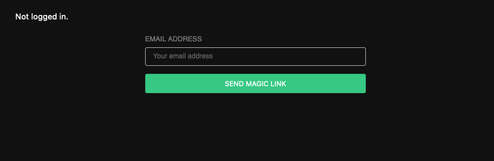
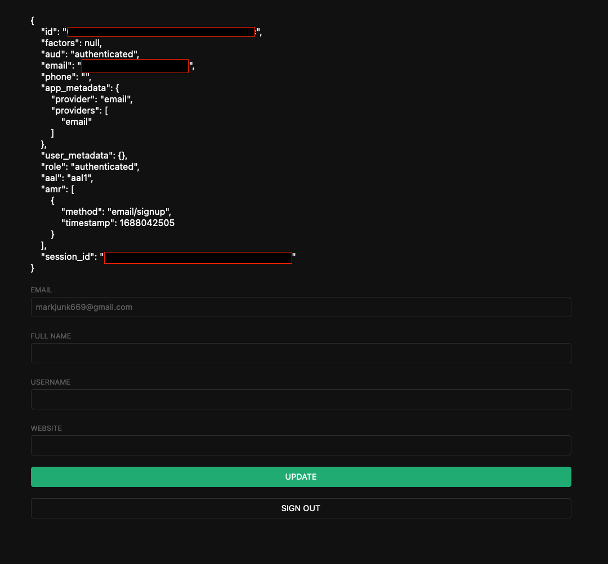

# Supabase Tutorial

- [Supabase Tutorial](#supabase-tutorial)
  - [01. Getting Started - Build a User Management App with SvelteKit](#01-getting-started---build-a-user-management-app-with-sveltekit)
    - [Project Setup](#project-setup)
    - [Build App](#build-app)
    - [Supabase Auth Helpers](#supabase-auth-helpers)
    - [Setup Login Page](#setup-login-page)
    - [Proof Key for Code Exchange (PKCE)](#proof-key-for-code-exchange-pkce)
    - [Account Page](#account-page)
    - [Profile Photos](#profile-photos)

Worth looking at:
* [Getting Started - Build a User Management App with SvelteKit](https://supabase.com/docs/guides/getting-started/tutorials/with-sveltekit)
* [Auth - Supabase Auth with SvelteKit](https://supabase.com/docs/guides/auth/auth-helpers/sveltekit#install-sveltekit-auth-helpers-library)
* [Getting Started - Local Development](https://supabase.com/docs/guides/getting-started/local-development)

## 01. Getting Started - Build a User Management App with SvelteKit

Following:
* [Build a User Management App with SvelteKit](https://supabase.com/docs/guides/getting-started/tutorials/with-sveltekit)

### Project Setup

Create a project on the [Supabase Dashboard](https://app.supabase.com/projects)

Go to the SQL Editor, and click **User Management Starter**.

Run.

### Build App

```bash
npm create svelte@latest .
# ┌  Welcome to SvelteKit!
# │
# ◇  Which Svelte app template?
# │  Skeleton project
# │
# ◇  Add type checking with TypeScript?
# │  Yes, using TypeScript syntax
# │
# ◇  Select additional options (use arrow keys/space bar)
# │  none
# │
# └  Your project is ready!
npm install
npm install @supabase/supabase-js
```

Create `.env` using config from Supabase Project Dashboard:
```env
PUBLIC_SUPABASE_URL="YOUR_SUPABASE_URL"
PUBLIC_SUPABASE_ANON_KEY="YOUR_SUPABASE_KEY"
```

> Note: `.env.local` will take precedence over `.env` if one exists

### Supabase Auth Helpers

Install modules:
```bash
npm install @supabase/auth-helpers-sveltekit @supabase/supabase-js
```

Setup server hooks in `src/hooks.server.ts` so auth is easily accessible from front and back-ends:
```ts
import { PUBLIC_SUPABASE_URL, PUBLIC_SUPABASE_ANON_KEY } from '$env/static/public'
import { createSupabaseServerClient } from '@supabase/auth-helpers-sveltekit'
import type { Handle } from '@sveltejs/kit'

export const handle: Handle = async ({ event, resolve }) => {
  event.locals.supabase = createSupabaseServerClient({
    supabaseUrl: PUBLIC_SUPABASE_URL,
    supabaseKey: PUBLIC_SUPABASE_ANON_KEY,
    event,
  })

  /**
   * A convenience helper so we can just call await getSession() instead const { data: { session } } = await supabase.auth.getSession()
   */
  event.locals.getSession = async () => {
    const {
      data: { session },
    } = await event.locals.supabase.auth.getSession()
    return session
  }

  return resolve(event, {
    filterSerializedResponseHeaders(name) {
      return name === 'content-range'
    },
  })
}
```

Declare additional types in `src/app.d.ts`:
```ts
import { SupabaseClient, Session } from '@supabase/supabase-js'

declare global {
  namespace App {
    interface Locals {
      supabase: SupabaseClient
      getSession(): Promise<Session | null>
    }
    interface PageData {
      session: Session | null
    }
    // interface Error {}
    // interface Platform {}
  }
}
```

Create `src/routes/+layout.server.ts`:
```ts
export const load = async ({ locals: { getSession } }) => {
  return {
    session: await getSession(),
  }
}
```

Create `src/routes/+layout.ts`:
```ts
import { invalidate } from '$app/navigation'
import { PUBLIC_SUPABASE_ANON_KEY, PUBLIC_SUPABASE_URL } from '$env/static/public'
import { createSupabaseLoadClient } from '@supabase/auth-helpers-sveltekit'

export const load = async ({ fetch, data, depends }) => {
  depends('supabase:auth')

  const supabase = createSupabaseLoadClient({
    supabaseUrl: PUBLIC_SUPABASE_URL,
    supabaseKey: PUBLIC_SUPABASE_ANON_KEY,
    event: { fetch },
    serverSession: data.session,
  })

  const {
    data: { session },
  } = await supabase.auth.getSession()

  return { supabase, session }
}
```

Update `src/routes/+layout.svelte`:
```svelte
<script lang="ts">
	import '../styles.css'
	import { invalidate } from '$app/navigation'
	import { onMount } from 'svelte'

	export let data

	let { supabase, session } = data
	$: ({ supabase, session } = data)

	onMount(() => {
		const { data } = supabase.auth.onAuthStateChange((event, _session) => {
			if (_session?.expires_at !== session?.expires_at) {
				invalidate('supabase:auth')
			}
		})

		return () => data.subscription.unsubscribe()
	})
</script>

<svelte:head>
	<title>User Management</title>
</svelte:head>

<div class="container" style="padding: 50px 0 100px 0">
	<slot />
</div>
```

### Setup Login Page

Install NPM libraries:
```bash
npm install @supabase/auth-ui-svelte @supabase/auth-ui-shared
```


Update `src/routes/+page.svelte`:
```svelte
<script lang="ts">
	import { Auth } from '@supabase/auth-ui-svelte'
	import { ThemeSupa } from '@supabase/auth-ui-shared'

	export let data
</script>

<svelte:head>
	<title>User Management</title>
</svelte:head>

<div class="row flex-center flex">
	<div class="col-6 form-widget">
		<Auth
			supabaseClient={data.supabase}
			view="magic_link"
			redirectTo={`${data.url}/auth/callback`}
			showLinks={false}
			appearance={{ theme: ThemeSupa, style: { input: 'color: #fff' } }}
            additionalData={{}}
		/>
	</div>
</div>
```

Create `src/routes/+page.server.ts`:
```ts
import { redirect } from '@sveltejs/kit'
import type { PageServerLoad } from './$types'

export const load: PageServerLoad = async ({ url, locals: { getSession } }) => {
  const session = await getSession()

  // if the user is already logged in return them to the account page
  if (session) {
    throw redirect(303, '/account')
  }

  return { url: url.origin }
}
```



### Proof Key for Code Exchange (PKCE)

Create `src/routes/auth/callback/+server.ts`
```ts
import { redirect } from '@sveltejs/kit'

export const GET = async ({ url, locals: { supabase } }) => {
  const code = url.searchParams.get('code')

  if (code) {
    await supabase.auth.exchangeCodeForSession(code)
  }

  throw redirect(303, '/account')
}
```

### Account Page

Create `src/routes/account/+page.svelte`:
```svelte
<script lang="ts">
	import { enhance } from '$app/forms';
	import type { SubmitFunction } from '@sveltejs/kit';

	export let data;
	export let form;

	let { session, supabase, profile } = data;
	$: ({ session, supabase, profile } = data);

	let profileForm: HTMLFormElement;
	let loading = false;
	let fullName: string = profile?.full_name ?? '';
	let username: string = profile?.username ?? '';
	let website: string = profile?.website ?? '';
	let avatarUrl: string = profile?.avatar_url ?? '';

	const handleSubmit: SubmitFunction = () => {
		loading = true;
		return async () => {
			loading = false;
		};
	};

	const handleSignOut: SubmitFunction = () => {
		loading = true;
		return async ({ update }) => {
			loading = false;
			update();
		};
	};
</script>

<div class="form-widget">
	<form
		class="form-widget"
		method="post"
		action="?/update"
		use:enhance={handleSubmit}
		bind:this={profileForm}
	>
		<div>
			<label for="email">Email</label>
			<input id="email" type="text" value={session.user.email} disabled />
		</div>

		<div>
			<label for="fullName">Full Name</label>
			<input id="fullName" name="fullName" type="text" value={form?.fullName ?? fullName} />
		</div>

		<div>
			<label for="username">Username</label>
			<input id="username" name="username" type="text" value={form?.username ?? username} />
		</div>

		<div>
			<label for="website">Website</label>
			<input id="website" name="website" type="url" value={form?.website ?? website} />
		</div>

		<div>
			<input
				type="submit"
				class="button block primary"
				value={loading ? 'Loading...' : 'Update'}
				disabled={loading}
			/>
		</div>
	</form>

	<form method="post" action="?/signout" use:enhance={handleSignOut}>
		<div>
			<button class="button block" disabled={loading}>Sign Out</button>
		</div>
	</form>
</div>
```

Create `src/routes/account/+page.server.ts`:
```ts
import { fail, redirect } from '@sveltejs/kit'

export const load = async ({ locals: { supabase, getSession } }) => {
  const session = await getSession()

  if (!session) {
    throw redirect(303, '/')
  }

  const { data: profile } = await supabase
    .from('profiles')
    .select(`username, full_name, website, avatar_url`)
    .eq('id', session.user.id)
    .single()

  return { session, profile }
}

export const actions = {
  update: async ({ request, locals: { supabase, getSession } }) => {
    const formData = await request.formData()
    const fullName = formData.get('fullName') as string
    const username = formData.get('username') as string
    const website = formData.get('website') as string
    const avatarUrl = formData.get('avatarUrl') as string

    const session = await getSession()

    const { error } = await supabase.from('profiles').upsert({
      id: session?.user.id,
      full_name: fullName,
      username,
      website,
      avatar_url: avatarUrl,
      updated_at: new Date(),
    })

    if (error) {
      return fail(500, {
        fullName,
        username,
        website,
        avatarUrl,
      })
    }

    return {
      fullName,
      username,
      website,
      avatarUrl,
    }
  },
  signout: async ({ locals: { supabase, getSession } }) => {
    const session = await getSession()
    if (session) {
      await supabase.auth.signOut()
      throw redirect(303, '/')
    }
  },
}
```

> 1. User clicks on the `Auth` component button
> 2. Recieves Email with magic link
> 3. Navigates to Supabase special link
> 4. Gets redirected to the callback URL set-up in SvelteKit `/auth/callback`
> 5. Hopefully gets logged in
> 6. Redirected to account page `/account`



### Profile Photos
